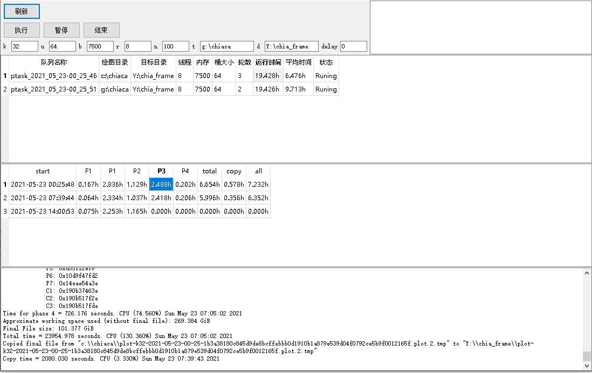

# chiaplot
chiaplot 图形界面管理 分析数据

# 界面预览

# 功能
- 支持队列配置
- 支持查看队列的状态
- 支持各个步骤的时间
- 查看各个任务的日志
- 查看历史任务的日志

# 使用方法
- 将disk目录下的main.exe复制到chia官方钱包的目录即可
（C:\Users\Administrator\AppData\Local\chia-blockchain\app-1.1.5\resources\app.asar.unpacked\daemon）app-1.1.5版本官方钱包路径
- 双击运行
- 配置界面的参数（参数与官方一致）
- 点击执行即可
- 秘钥使用官方钱包默认秘钥（安装完官方钱包后，用自己的助记词登录，本软件不输入任何秘钥相关信息）

# 参数配置
-k [size]：定义绘图的大小。不同系统上的k大小和创建时间列表请查看：

-u [buckets数量]。更多的数据包可以减少对内存的需求，但需要更多的随机磁盘搜索。对于机械磁盘，你需要设置更少的buckets，而对于NVMe固态硬盘，你可以设置更多的buckets。一般来说，你可以设置32、64或128（默认）。这个值建议根据自己硬盘实际情况设置。
-b [内存缓冲区大小MiB]。定义内存/RAM使用量。默认值是2048 (2GiB)。更多的内存将略微提高绘图的速度。请记住，这只是分配给绘图算法的内存。运行钱包等将需要你的系统提供额外的内存。这个默认值或稍大即可。
-r [线程数]: 2线程通常是最佳的。多线程目前只在P盘第一阶段使用。该值建议就设为2即可。
-n [绘图数量]。按顺序进行的绘图数量。一旦一个绘图完成，它将被移动到最终位置-d，然后再开始下一个绘图序列。由于是按顺序执行任务，而不是像Windows系统上那样可以并行执行任务，建议设置小一点。
-t [tmp dir]。定义P盘时的临时目录。这里是P盘的第一阶段和第二阶段需要使用。-t 路径需要最大的工作空间：通常是最终plot文件大小的 4 倍左右，可以查看上图。
-d [final dir]: 定义存储plot文件的最终位置。当然，-d 应该有足够的可用空间作为Plot文件的最终大小。这个目录会自动添加到 ~/.chia/VERSION/config/config.yaml 文件中。你可以使用 chia plots remove -d 从配置中删除一个最终目录。
