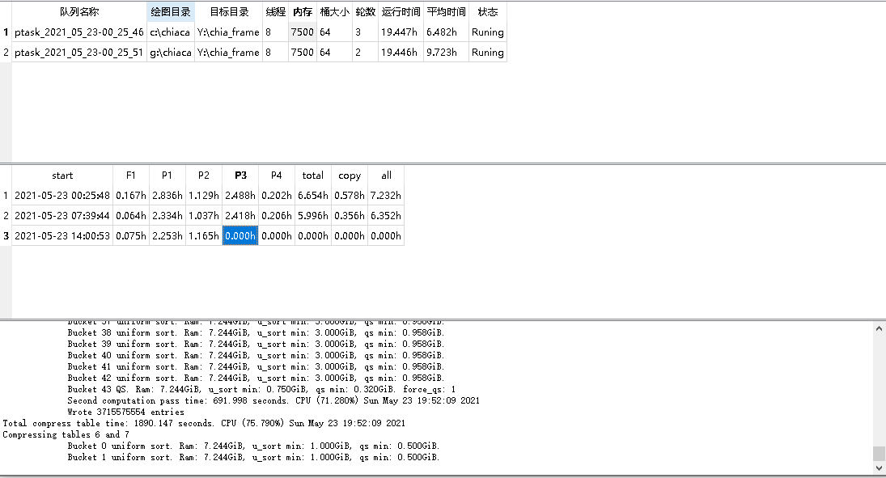

# chiaplot
chiaplot 图形界面管理 分析数据

# 界面预览

# 功能
- 支持队列配置
- 支持查看队列的状态
- 支持各个步骤的时间
- 查看各个任务的日志
- 查看历史任务的日志

# 使用方法
- 将disk目录下的main.exe复制到chia官方钱包的目录即可
（C:\Users\Administrator\AppData\Local\chia-blockchain\app-1.1.5\resources\app.asar.unpacked\daemon）app-1.1.5版本官方钱包路径
- 双击运行
- 配置界面的参数（参数与官方一致）
- 点击执行即可
- 秘钥使用官方钱包默认秘钥（安装完官方钱包后，用自己的助记词登录，本软件不输入任何秘钥相关信息）
